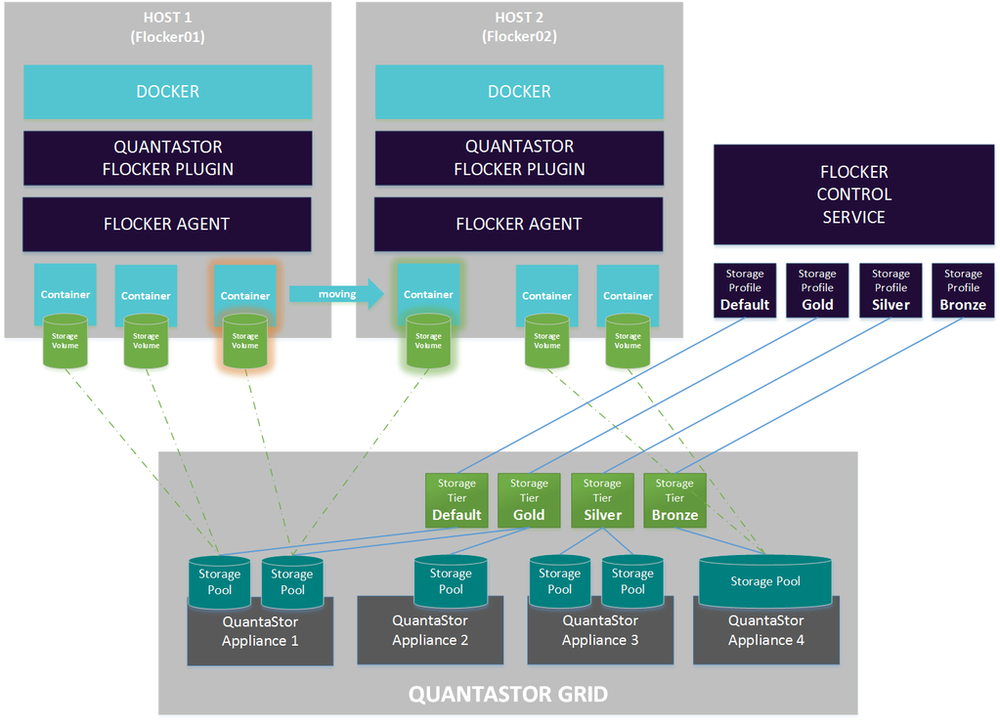
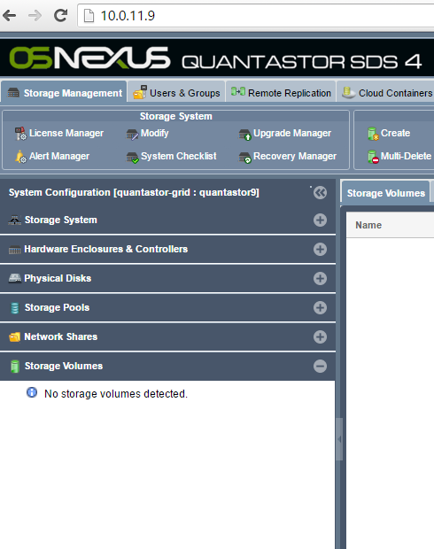
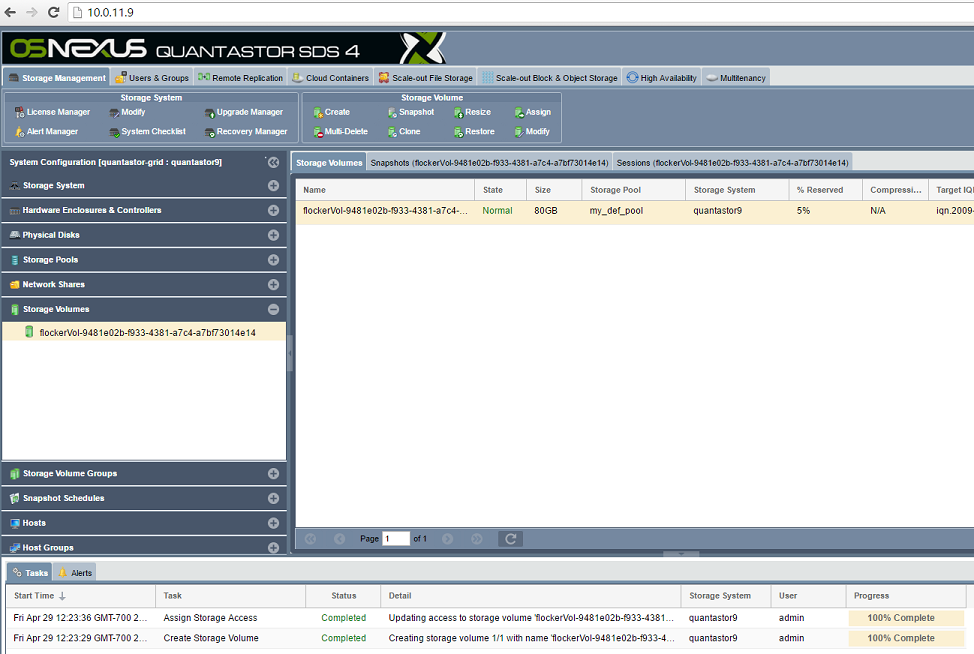
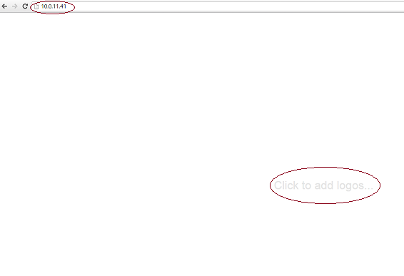
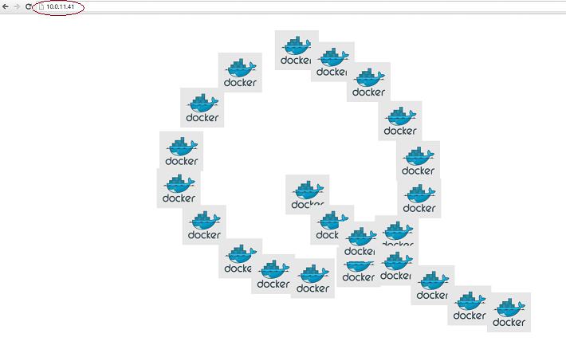
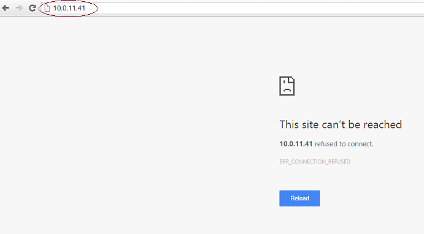
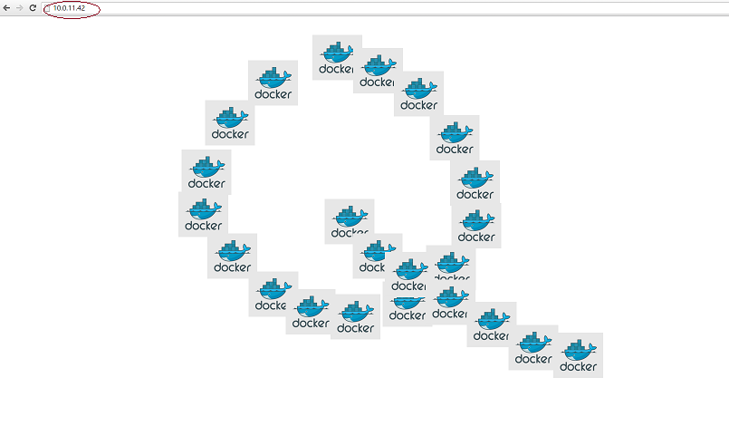

# OSNEXUS QuantaStor volume plugin demo
ClusterHQ/Flocker provides an easy way for Docker containers to persist data. OSNEXUS QuantaStor plugin for Flocker provides fast persistent data for Docker containers.
This is to demonstrate the migration of data in Docker containers using the OSNEXUS QuantaStor plugin for Flocker.



# Prerequisites
* Requires existing Flocker installation.
* Requires isciadm. To configure the flocker nodes as iSCSI initiator install the open-iscsi package
* Requires the OSNEXUS QuantaStor plugin installed on all the Flocker nodes. 
For details on installing the OSNEXUS Quantastor plugin please visit (https://github.com/OSNEXUS/flocker-driver)

# Procedure
We have a two layered application with a database layer and the famous moby-counter web server. Our stateful application will start on the first Flocker node and write data. This data will persist 
on a QuantaStor volume. We will then stop the application and start it on the second Flocker node. The data should persist on the newly started container. We use Docker compose to start the containers.

# Step 1 :
Clone this repository on all the Flocker nodes (https://github.com/OSNEXUS/flocker-demo).

In our examples we are calling our Flocker nodes Flocker01 (10.0.11.41) and Flocker02 (10.0.11.42)
```bash
git clone https://github.com/OSNEXUS/flocker-demo
```

# Step 2 : 
Connect to the QuantaStor UI using the IP address of your Quantastor system (Example : http://10.0.11.9)
You will see that no volumes are present at this point.




# Step 3 :
These commands are executed on the first Flocker node. In our example it is flocker01 (10.0.11.41)
```bash
root@flocker01: cd flocker-demo
root@flocker01: docker-compose up -d
```

# Step 4 :
You will see a volume created on QuantaStor.



Verify that our application is up and running on Flocker01 by connecting to (http://10.0.11.41)



# Step 5
Add data to the application by clicking on the the web page (http://10.0.11.41)



# Step 6
Now we will stop the application on Flocker01
```bash
root@flocker01: docker-compose stop
```
Verify that the application is no longer available at (http://10.0.11.41)



# Step 7
Now perform these steps from the second Flocker node. In our example it is flocker02 (10.0.11.42)
```bash
root@flocker02: cd flocker-demo
root@flocker02: docker-compose up -d
```
Verify that our application is up and running on Flocker02 by connect to (http://10.0.11.42)
The data should be persistent in the database and you should see the same data which was written on Flocker01.

**_Note that we are viewing the data on the second Flocker node and its the same data_**



Verify that the application is running on Flocker02
```
root@flocker02: docker ps
CONTAINER ID        IMAGE                            COMMAND                  CREATED             STATUS              PORTS                NAMES
d79115e01fa6        binocarlos/moby-counter:latest   "node index.js"          About an hour ago   Up 2 minutes        0.0.0.0:80->80/tcp   demo2_web_1
f33e2a4b3a9a        redis:latest                     "/entrypoint.sh redis"   About an hour ago   Up 2 minutes        6379/tcp             demo2_redis_1

```
# Conclusion
Using Docker and Flocker we demonstrated the migration of data from one Flocker node to the other. The data was made available by the OSNEXUS QuantaStor plugin for Flocker.

# Trouble Shooting and Support
Flocker logs are located at /var/log/flocker.
OSNEXUS QuantaStor plugin logs can be found in the same directory /var/log/flocker/qs_flocker.log
Please file bugs and issues at the Github issues page. Please contact OSNEXUS support (support@osnexus.com) for any issues.


